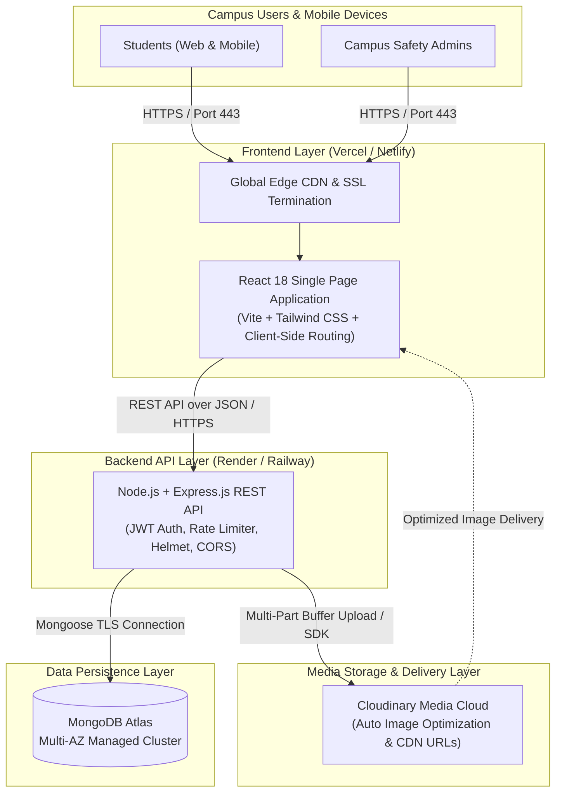

# LostLink Cloud Architecture & Infrastructure

Detailed architectural overview and cloud deployment blueprint for **LostLink – Smart Campus Lost & Found Management System**.

---

## 1. High-Level Cloud Architecture Diagram

---

## 2. Cloud Service Breakdown & Roles

### A. Frontend Hosting — Vercel / Netlify
- **Technology**: React.js with Vite
- **Role**: Serves pre-built static assets (HTML, CSS, JS bundles) via a globally distributed Content Delivery Network (CDN).
- **Key Features**:
  - Edge caching and instant page loads.
  - Automatic HTTPS and TLS certificates.
  - Single Page Application (SPA) fallback routing via `vercel.json` rewrites.

### B. Backend API Hosting — Render / Railway
- **Technology**: Node.js v20+ with Express.js
- **Role**: Stateless RESTful API service handling business logic, authentication, input validation, and claim workflows.
- **Key Features**:
  - Zero-downtime rolling deploys.
  - Native environment variable management.
  - Health check endpoint monitoring at `/api/health`.

### C. Database — MongoDB Atlas
- **Role**: Fully managed, auto-scaling NoSQL cloud database cluster.
- **Key Features**:
  - Automated backups and failover across multiple availability zones.
  - Native text indexes for full-text search across item titles, categories, and campus locations.
  - TLS 1.3 encrypted data-in-transit and AES-256 encrypted data-at-rest.

### D. Media & Asset Cloud — Cloudinary
- **Role**: Cloud storage, transformation, and CDN distribution for item photos and student avatars.
- **Key Features**:
  - On-the-fly image compression, thumbnail generation, and WEBP auto-conversion.
  - Secure authenticated direct buffer streaming via API secrets.

---

## 3. Security Architecture & Hardening

1. **Authentication**: Stateless JSON Web Tokens (JWT) signed with HMAC-SHA256 and expiration window (30 days).
2. **Password Protection**: Passwords hashed with `bcryptjs` using 10 cryptographic salt rounds before saving. Passwords are never returned in queries (`select: false`).
3. **Cross-Origin Resource Sharing (CORS)**: Strict origin whitelisting allowing only verified client domains in production.
4. **HTTP Header Security**: `helmet` headers active to mitigate XSS, Clickjacking, and MIME sniffing attacks.
5. **Rate Limiting**: `express-rate-limit` prevents brute-force attempts on sensitive `/api/auth` routes.
6. **Input Sanitization**: Mongoose schemas enforce strong type validation and prevent SQL/NoSQL injection.

---

## 4. Production Deployment Guide

### Step 1: Set Up MongoDB Atlas
1. Create a free cluster at [MongoDB Atlas](https://www.mongodb.com/cloud/atlas).
2. Create a Database User with username and password.
3. In **Network Access**, add IP `0.0.0.0/0` (Allow access from anywhere for cloud instances).
4. Copy the connection string: `mongodb+srv://<user>:<password>@cluster0.xxx.mongodb.net/lostlink?retryWrites=true&w=majority`.

### Step 2: Set Up Cloudinary
1. Create a free account at [Cloudinary](https://cloudinary.com).
2. Retrieve your **Cloud Name**, **API Key**, and **API Secret** from the Dashboard.

### Step 3: Deploy Backend to Render
1. Connect your GitHub repository on Render.
2. Select **Web Service**.
3. Settings:
   - **Root Directory**: `backend`
   - **Build Command**: `npm install`
   - **Start Command**: `npm start`
4. Set Environment Variables in the Render dashboard:
   - `PORT`: `5000`
   - `NODE_ENV`: `production`
   - `MONGODB_URI`: `<Your MongoDB Atlas connection URI>`
   - `JWT_SECRET`: `<A strong random 64-char secret>`
   - `CLOUDINARY_CLOUD_NAME`: `<Your Cloud Name>`
   - `CLOUDINARY_API_KEY`: `<Your Cloudinary API Key>`
   - `CLOUDINARY_API_SECRET`: `<Your Cloudinary API Secret>`
   - `CLIENT_URL`: `https://your-lostlink-frontend.vercel.app`

### Step 4: Deploy Frontend to Vercel
1. Import repository on [Vercel](https://vercel.com).
2. Settings:
   - **Framework Preset**: `Vite`
   - **Root Directory**: `frontend`
   - **Build Command**: `npm run build`
   - **Output Directory**: `dist`
3. Set Environment Variable:
   - `VITE_API_URL`: `https://your-lostlink-api.onrender.com/api`
4. Deploy!
