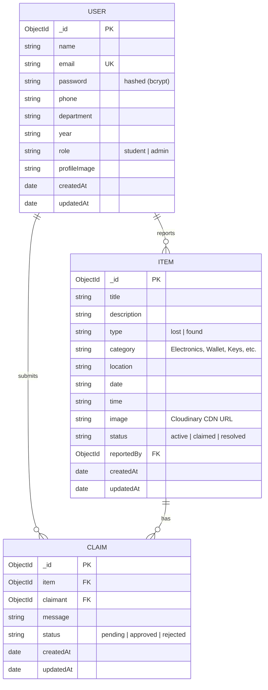

# LostLink Database Design & Architecture

Comprehensive database schema documentation for **LostLink – Smart Campus Lost & Found Management System**, implemented with **MongoDB** and **Mongoose ODM**.

---

## 1. Entity-Relationship Diagram (ERD)



---

## 2. Collections & Schema Definitions

### A. `users` Collection

Stores authenticated student and administrative accounts with encrypted credentials and academic metadata.

| Field | Type | Required | Constraints / Values | Description |
| :--- | :--- | :--- | :--- | :--- |
| `_id` | `ObjectId` | Auto | Unique Primary Key | User ID |
| `name` | `String` | Yes | Trimmed, Max 60 chars | Student or Admin full name |
| `email` | `String` | Yes | Unique, Lowercase, Regex validated | Institutional or campus email |
| `password` | `String` | Yes | Min 6 chars, `select: false` | Bcrypt hash (Salt rounds: 10) |
| `phone` | `String` | No | Default: `""` | Verification contact phone |
| `department` | `String` | No | Default: `"General"` | Academic faculty / division |
| `year` | `String` | No | Default: `"1st Year"` | Academic year level / status |
| `role` | `String` | Yes | Enum: `['student', 'admin']` | Authorization access level |
| `profileImage` | `String` | No | Default: `""` | Avatar image URL |
| `createdAt` | `Date` | Auto | ISO Timestamp | Registration date |
| `updatedAt` | `Date` | Auto | ISO Timestamp | Last profile update |

**Indexes**:
- `{ email: 1 }` (Unique)

---

### B. `items` Collection

Stores all lost and found item listings submitted by campus members.

| Field | Type | Required | Constraints / Values | Description |
| :--- | :--- | :--- | :--- | :--- |
| `_id` | `ObjectId` | Auto | Unique Primary Key | Item ID |
| `title` | `String` | Yes | Max 100 chars, Trimmed | Short descriptive title |
| `description` | `String` | Yes | Max 1000 chars, Trimmed | Details, unique markings, color |
| `type` | `String` | Yes | Enum: `['lost', 'found']` | Classification of listing |
| `category` | `String` | Yes | Enum (9 categories) | Electronics, ID Card, Wallet, etc. |
| `location` | `String` | Yes | Max 120 chars | Campus spot, building, room |
| `date` | `String` | Yes | YYYY-MM-DD | Date item was lost/found |
| `time` | `String` | No | HH:MM | Approximate time of incident |
| `image` | `String` | No | Default: `""` | Cloudinary CDN image URL |
| `status` | `String` | Yes | Enum: `['active', 'claimed', 'resolved']` | Current lifecycle state |
| `reportedBy` | `ObjectId` | Yes | Ref: `User` | User who created the report |
| `createdAt` | `Date` | Auto | ISO Timestamp | Publication timestamp |
| `updatedAt` | `Date` | Auto | ISO Timestamp | Last modification timestamp |

**Indexes**:
- Text Search: `{ title: 'text', description: 'text', location: 'text' }`
- Compound Filter: `{ type: 1, status: 1, category: 1 }`
- Ownership Query: `{ reportedBy: 1 }`

---

### C. `claims` Collection

Facilitates the ownership dispute and verification workflow between students.

| Field | Type | Required | Constraints / Values | Description |
| :--- | :--- | :--- | :--- | :--- |
| `_id` | `ObjectId` | Auto | Unique Primary Key | Claim ID |
| `item` | `ObjectId` | Yes | Ref: `Item` | Associated item reference |
| `claimant` | `ObjectId` | Yes | Ref: `User` | Student asserting ownership |
| `message` | `String` | Yes | Max 1000 chars | Proof, secret identifier, serial |
| `status` | `String` | Yes | Enum: `['pending', 'approved', 'rejected']` | Review decision state |
| `createdAt` | `Date` | Auto | ISO Timestamp | Submission timestamp |
| `updatedAt` | `Date` | Auto | ISO Timestamp | Resolution timestamp |

**Indexes**:
- Compound: `{ item: 1, claimant: 1 }`
- User Claims: `{ claimant: 1 }`

---

## 3. Example JSON Documents

### Sample User Document
```json
{
  "_id": { "$oid": "65e23f9a7d32c001a1b2c3d4" },
  "name": "Alex Rivera",
  "email": "alex.rivera@campus.edu",
  "password": "$2a$10$e8wYp91.5x8X/V15XF57aOG31.n...",
  "phone": "+1 (555) 234-5678",
  "department": "Computer Science & Engineering",
  "year": "3rd Year",
  "role": "student",
  "profileImage": "https://images.unsplash.com/photo-1539571696357-5a69c17a67c6?w=300",
  "createdAt": { "$date": "2025-03-01T10:00:00.000Z" },
  "updatedAt": { "$date": "2025-03-01T10:00:00.000Z" }
}
```

### Sample Item Document
```json
{
  "_id": { "$oid": "65e24a1b7d32c001a1b2c3d5" },
  "title": "Space Gray MacBook Air M2",
  "description": "Left on 3rd floor study desk in Library. Has a rocket sticker on top corner.",
  "type": "lost",
  "category": "Electronics",
  "location": "Central Library - 3rd Floor Quiet Zone",
  "date": "2025-02-28",
  "time": "14:30",
  "image": "https://images.unsplash.com/photo-1517336714731-489689fd1ca8?w=800",
  "status": "active",
  "reportedBy": { "$oid": "65e23f9a7d32c001a1b2c3d4" },
  "createdAt": { "$date": "2025-03-01T11:00:00.000Z" },
  "updatedAt": { "$date": "2025-03-01T11:00:00.000Z" }
}
```

### Sample Claim Document
```json
{
  "_id": { "$oid": "65e24c2d7d32c001a1b2c3d7" },
  "item": { "$oid": "65e24a1b7d32c001a1b2c3d5" },
  "claimant": { "$oid": "65e23f9a7d32c001a1b2c3d4" },
  "message": "My laptop serial is C02G9... and the lock screen wallpaper is Yosemite.",
  "status": "pending",
  "createdAt": { "$date": "2025-03-01T12:00:00.000Z" },
  "updatedAt": { "$date": "2025-03-01T12:00:00.000Z" }
}
```
